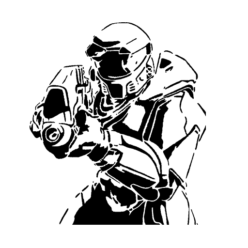

<html>
    <p align="center">
        
    </p>
    <h1 align="center">Mimic</h1>
    <p align="center">
       Events and Objects Synchronization for Halo Custom Edition
    </p>
</html>

Network Sync for Halo Custom Edition, a project that aims to provide Object / AI synchronization in the most
optimized and simple way as possible, made with Lua using Balltze, SAPP and Chimera.

# Getting Mimic
Get the latest version of the mod using the Mercury command:
```
mercury install mimic
```
# How it works?
Mimic is capable of syncing different aspects of the game, like AI bipeds, device machines, bsp index,
and script events, by providing a server script that tracks all the data of every aspect we want to
sync using Lua scripting on the server side and sending that information back to the client players
connected to the server that need that information depending on the situation.

**NOTE:** By now script events only can be synced by recompiling target map HSC using an script
rewriter via the **Mimic Adapter Tool**.

# Features
- [x] Matches server side bipeds to client side bipeds
- [x] Object permutations sync
- [x] Object color permutation sync
- [x] Object weapon carrying sync
- [x] Bipeds vehicles sync (only for non driver bipeds)
- [x] BSP index sync
- [x] Device machines sync (only for named machines)
- [x] Sync server side projectiles (only works well on certain projectiles)
- [x] Script events sync (only on recompiled maps)
- [ ] Object special properties sync (such as levitate, shield, camera, etc)
- [ ] Object client side patching (allow sounds being played on client side)

# Can I contribute/help?
This project is on early development, feel free to contribute and join our [Discord server](https://discord.shadowmods.net)
server if you want to get more information about design, goals and updates for the project.